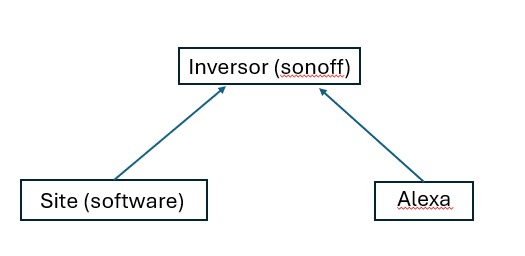
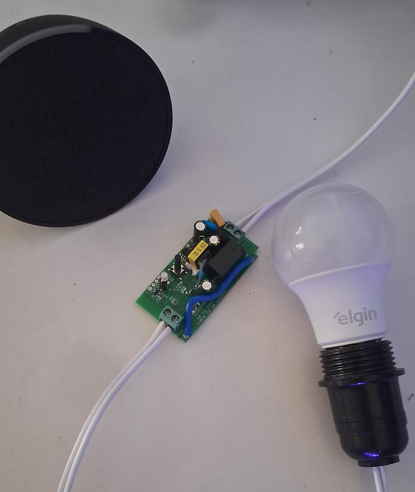

# Projeto Goodwe 
Neste repositorio esta o codigo fonte de todas as funcionalidade que colocamos em nosso site 


## Como utilizar
Baixe o requirements.txt (recomendo q use um ambeinte virtual)\
Crie um arquivo chamado .env para adicionar sua chave do gemini studio neste formato:
```
API_GEMINI_KEY='sua chave'
```
Em seguida ative os arquivos .py \
Colocando em diferentes terminais cada comando
```
python pergunta-ia.py
python recomendacao-ia.py 
python dados-sems.py
```


## Diagrama de Arquitetura 


Nesta imagem desmontra a estruturação que utilizamos para o funciomanento do projeto <br><br>

Abaixo deixei a forma que utilizamos de organização dos processos 

- Estudo
- Desenvolvimento do site
- Aplicação do sonoff
- Criação da vm pro home assitant
- Comunicação com alexa
- Integracao dos 3.

## Circuito
Utilizamos um esp8266 para fazer a implementação do tasmota como representado na imagem



##  Grupo 
1CCPH \
563415 Fernando Caires Silva \
563567 Raphael Mischiatti de Souza \
563500 Guilherme Martins Rezende